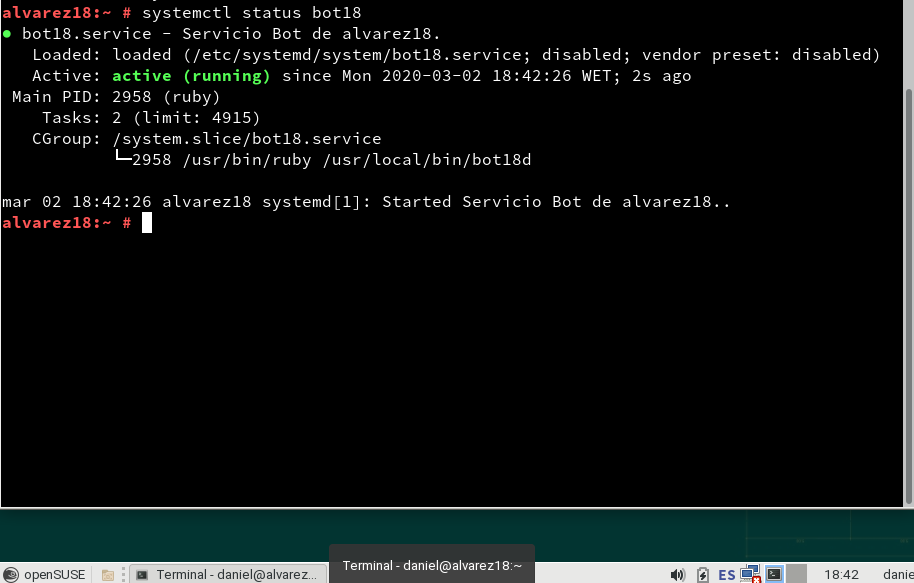

# Servicio de comunicaciones con Telegram (bot-service)

## 1.4 Entrega

 - Script del bot (/usr/local/bin/bot18d)

    ```
    #!/usr/bin/env ruby

    require 'telegram/bot'

    # token:
    # 1. Write your TOKEN value into "token" variable or
    # 2. Create a local file "hiden.token" with your TOKEN value inside
    token = `cat /usr/local/bin/hide.token`.strip
    bot_username = '@bot18'

    puts "[INFO] Running bot #{$0}..."

    Telegram::Bot::Client.run(token) do |bot|
      bot.listen do |message|
        puts " => #{message.text}"
        if message.text == "/hello"
          bot.api.send_message(chat_id: message.chat.id, text: "Hello Word!")
        elsif message.text == "/byebye"
          bot.api.send_message(chat_id: message.chat.id, text: "Bye bye!")
        elsif message.text == "/whoami"
          whoami = `whoami`
          bot.api.send_message(chat_id: message.chat.id, text: whoami)
        elsif message.text == "/ip"
          ip = `ip a | grep inet | grep eth0`.split
          bot.api.send_message(chat_id: message.chat.id, text:"Tiene asignada la ip #{ip[1]}" )
        elsif message.text == "/disk"
          space = `df -hT`
          bot.api.send_message(chat_id: message.chat.id, text:"Estado espacio: #{space}" )
        end
      end
    end

    ```

 - Funcionamiento del Bot en video.

 [!][(video.jpg)](https://youtu.be/-NF87V4uuE0 "Bot_Telegram")

## 2.4 Entrega

  - Fichero de configuración del servicio /etc/systemd/system/bot18.service.

      ```
      [Unit]
      Description=Servicio Bot de alvarez18.
      After=network.service

      [Service]
      Type=simple
      ExecStart=/usr/bin/ruby /usr/local/bin/bot18d

      [Install]
      WantedBy=multi-user.target

      ```

  - Capturas de pantalla donde se muestra que podemos iniciar y parar el servicio bot18 con el comando systemctl.

  Paramos el servicio:

  

  Arrancamos el servicio:

  

## 3.2 Tareas programadas

  - ```crontab -l```, vemos que no hay ninguna configuración creada.

    


  - ```crontab -e```, se nos abre un editor.

  - Pulsamos i(insert) y añadimos una configuración programa una ejecución del script cada 5 minutos:

    

  - ```crontab -l```, para consultar la tarea programada.

      

  - Paramos el servicio.

      

  - Esperamos 5 minutos y ahora debe haberse iniciado de forma automática (con crontab):

      
