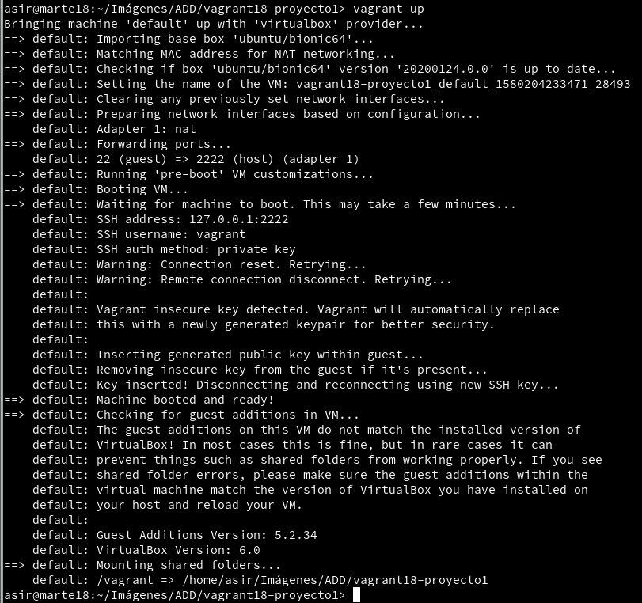
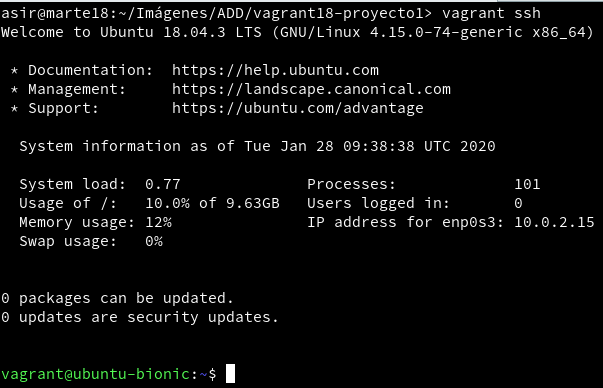
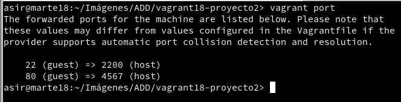
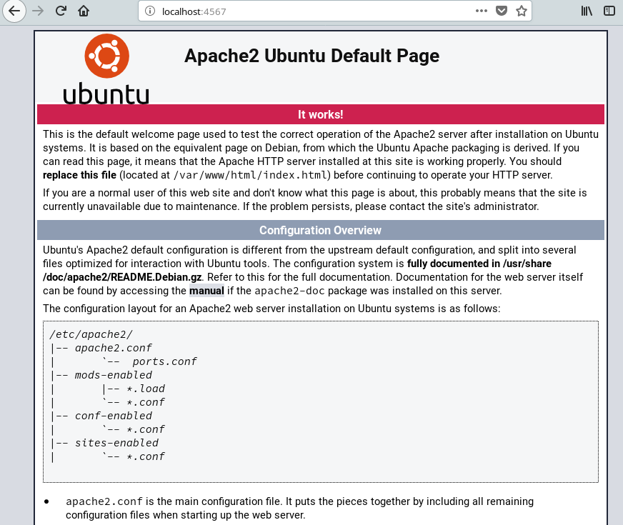
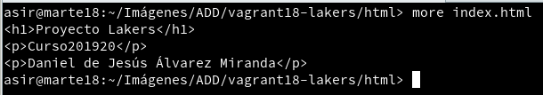
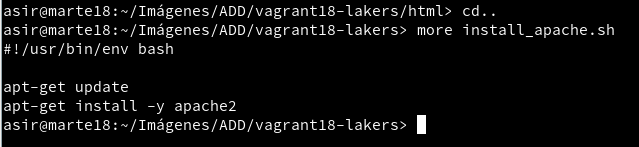
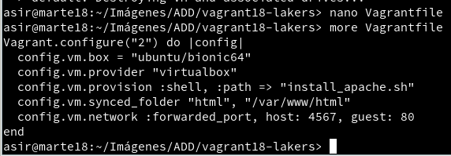
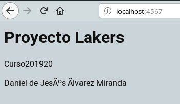
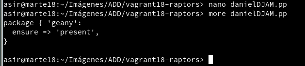

# Vagrant

## 3.3 Comprobar proyecto 1

Iniciamos la máquina.

Conectamos a nuestra MV mediante SSH.

## 5.2 Comprobar proyecto 2

Comprobamos que el puerto está a la escucha.

Comprobamos que funciona correctamente.

## 6.1 Suministro Shell script

Creamos el fichero index.html

Creamos el Script

Configuramos el Vagrantfile

Verificamos que el servidor Apache ha sido instalado e iniciado abriendo el navegador y poniendo la siguiente URL.

## Suministro Puppet

Modificar el archivo Vagrantfile

Creamos el fichero puppet con las instrucciones.

