# 1. Contenedores con Docker

> Enlaces de interés
> * [Docker for beginners](http://prakhar.me/docker-curriculum/)
> * [getting-started-with-docker](http://www.linux.com/news/enterprise/systems-management/873287-getting-started-with-docker)

## 1.1 Introducción

Es muy común que nos encontremos desarrollando una aplicación, y llegue el momento que decidamos tomar todos sus archivos y migrarlos, ya sea al ambiente de producción, de prueba, o simplemente probar su comportamiento en diferentes plataformas y servicios.

Para situaciones de este estilo existen herramientas que, entre otras cosas, nos facilitan el embalaje y despliegue de la aplicación, es aquí donde entra en juego Docker.

Esta herramienta nos permite crear lo que ellos denominan contenedores, lo cual son aplicaciones empaquetadas auto-suficientes, muy livianas, que son capaces de funcionar en prácticamente cualquier ambiente, ya que tiene su propio sistema de archivos, librerías, terminal, etc.

Docker es una tecnología contenedor de aplicaciones construida sobre LXC.

## 1.2. Requisitos

* Vamos a usar MV OpenSUSE.
* Nos aseguraremos que tiene una versión del Kernel 3.10 o superior (`uname -a`).

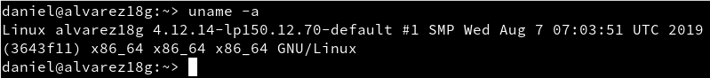

## 1.3 Habilitar el acceso a la red externa a los contenedores

Si queremos que nuestro contenedor tenga acceso a la red exterior, debemos activar la opción IP_FORWARD (`net.ipv4.ip_forward`). Lo podemos hacer en YAST. ¿Recuerdas lo que implica `forwarding` en los dispositivos de red?

| Sistema operativo | Activar "forwarding" |
| ----------------- | -------------------- |
| OpenSUSE Leap (configuración de red es Wicked) | Yast -> Dispositivos de red -> Encaminamiento -> Habilitar reenvío IPv4 |
| Cuando la red está gestionada por Network Manager | En lugar de usar YaST debemos editar el fichero "/etc/sysconfig/SuSEfirewall2" y poner FW_ROUTE="yes" |
| OpenSUSE Tumbleweed  | Yast -> Sistema -> Configuración de red -> Menú de encaminamiento |


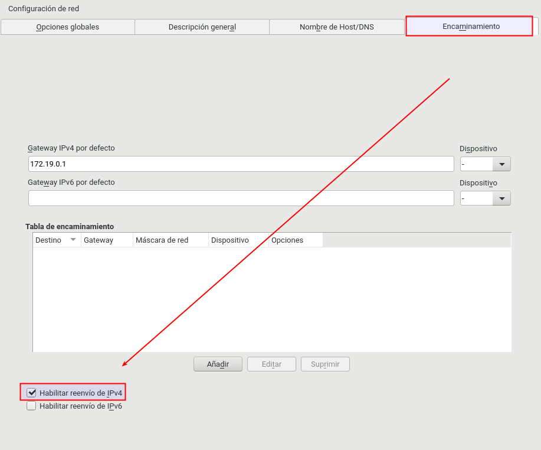

* Reiniciar el equipo para que se apliquen los cambios de configuración anteriores.

---
# 2. Instalación y primeras pruebas

> Enlaces de interés:
> * [EN - Docker installation on SUSE](https://docs.docker.com/engine/installation/linux/SUSE)
> * [ES - Curso de Docker en vídeos](jgaitpro.com/cursos/docker/)


## 2.1 Habilitar el acceso a la red externa a los contenedores

Si queremos que nuestro contenedor tenga acceso a la red exterior, debemos activar tener activada la opción IP_FORWARD (`net.ipv4.ip_forward`). ¿Recuerdas lo que implica `forwarding` en los dispositivos de red?

* `cat /proc/sys/net/ipv4/ip_forward`, para consultar el estado de IP_FORWARD (desactivado=0, activo=1).
* Para activarlo podemos poner el valor 1 en el fichero de texto indicado o usar Yast.
* Reiniciar el equipo para que se aplique el cambio de configuración.

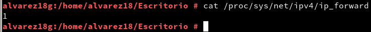

**Usar YAST para activar IP_FORWARD**

| Sistema operativo | Activar "forwarding" |
| ----------------- | -------------------- |
| OpenSUSE Leap (configuración de red es Wicked) | Yast -> Dispositivos de red -> Encaminamiento -> Habilitar reenvío IPv4 |
| Cuando la red está gestionada por Network Manager | En lugar de usar YaST debemos editar el fichero "/etc/sysconfig/SuSEfirewall2" y poner FW_ROUTE="yes" |
| OpenSUSE Tumbleweed  | Yast -> Sistema -> Configuración de red -> Menú de encaminamiento |


## 2.2 Instalación

* Ejecutar como superusuario:

```
zypper in docker        # Instala docker
systemctl start docker  # Inicia el servicio
                        # El comando "docker daemon" hace el mismo efecto
docker version          # Información de las versiones cliente y servidor
```

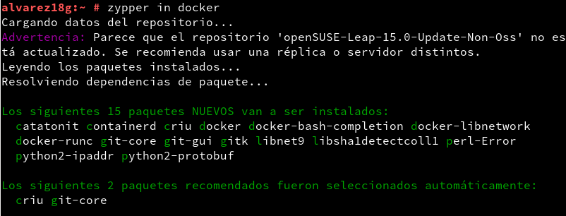

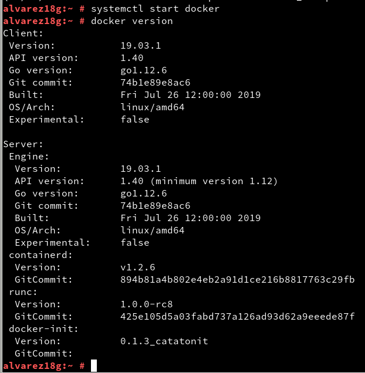


* Salir de la sesión y volver a entrar con nuestro usuario.

## 2.3 Primera prueba

* Ejecutar con nuestro usuario para comprobar que todo funciona:

```
docker images           # Muestra las imágenes descargadas hasta ahora
                        # No debe haber ninguna
docker ps -a            # Muestra todos los contenedores creados
                        # No debe haber ninguno
```

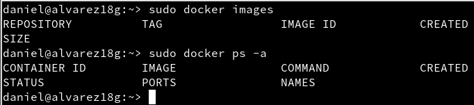


* Primera prueba:

```
docker run hello-world  # Descarga y ejecuta un contenedor
                        # con la imagen "hello-world"
                        # Sólo muestra un mensaje en pantalla.
docker images           # Vemos la nueva imagen
docker ps -a            # El contenedor está estado 'Exited'
```

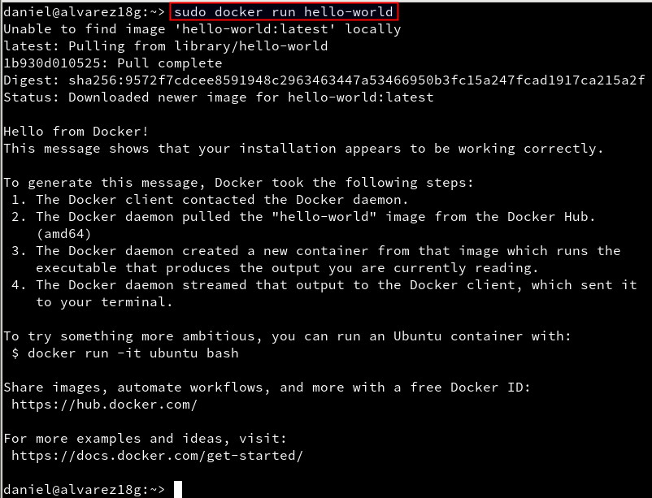

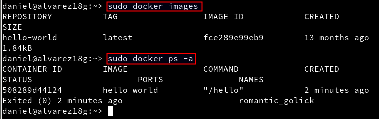


## 2.4 TEORIA: Información

Tabla de referencia para no perderse:

| Software   | Base   | Sirve para crear   | Aplicaciones |
| ---------- | ------ | ------------------ | ------------ |
| VirtualBox | ISO    | Máquinas virtuales | N |
| Vagrant    | Box    | Máquinas virtuales | N |
| Docker     | Imagen | Contenedores       | 1 |


Información sobre otros comandos útiles:

| Comando                     | Descripción |
| --------------------------- | ------------------- |
| `docker stop CONTAINERID`   | parar un contenedor |
| `docker start CONTAINERID`  | iniciar un contenedor |
| `docker attach CONTAINERID` | conectar el terminal actual con el interior de contenedor |
| `docker ps`                 | mostrar los contenedores en ejecución |
| `docker ps -a`              | mostrar todos los contenedores (en ejecución o no) |
| `docker rm CONTAINERID`     | eliminar un contenedor |
| `docker rmi IMAGENAME`      | eliminar una imagen |

---
# 3. Creación manual

Nuestro SO base es OpenSUSE, pero vamos a crear un contenedor Debian,
y dentro instalaremos Nginx.

## 3.1 Crear una imagen manualmente

**Descargar una imagen**
* `docker search debian`, buscamos en los repositorios de Docker Hub contenedores con la etiqueta `debian`.
* `docker pull debian`, descargamos una imagen en local.
* `docker images`, comprobamos.

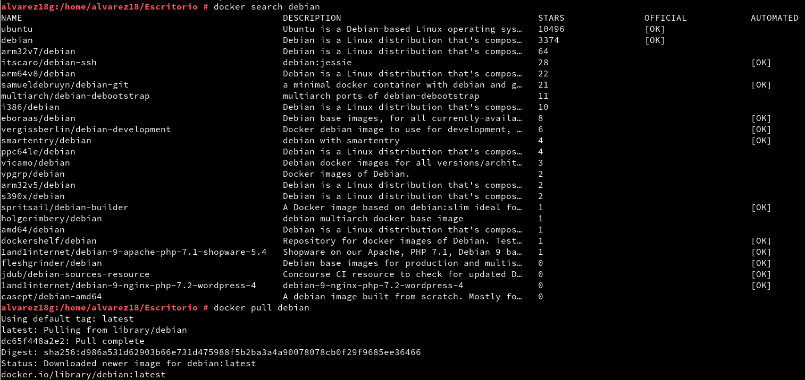

* Vamos a crear un contenedor con nombre `con_debian` a partir de la
imagen `debian:9`, y ejecutaremos `/bin/bash`:

```
docker run --name=con_debian -i -t debian:9 /bin/bash
```

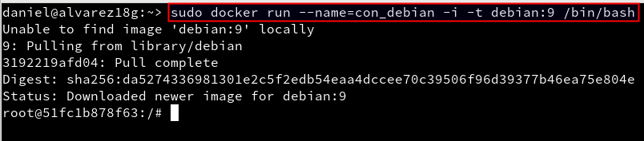

## 3.2 Personalizar el contenedor

Ahora que estamos dentro del contenedor, vamos a personalizarlo a nuestro gusto:

```
root@IDContenedor:/# cat /etc/motd            # Comprobamos que estamos en Debian
root@IDContenedor:/# apt-get update
root@IDContenedor:/# apt-get install -y nginx # Instalamos nginx en el contenedor
root@IDContenedor:/# apt-get install -y vim   # Instalamos editor vi en el contenedor
root@IDContenedor:/# /usr/sbin/nginx          # Iniciamos el servicio nginx
root@IDContenedor:/# ps -ef                   # Si no se encuentra el comando
                                              # ¿lo podemos instalar?
```

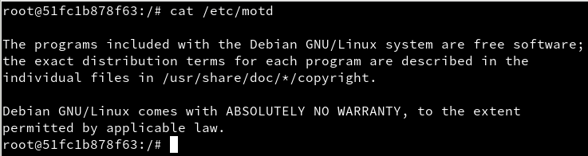

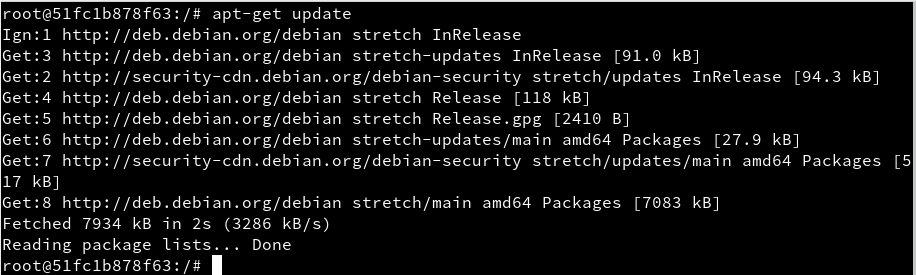

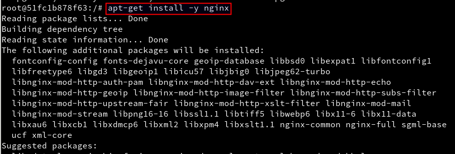

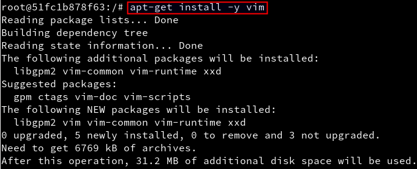

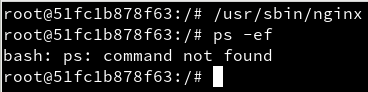


* Creamos un fichero HTML (`holamundo.html`).

```
root@IDContenedor:/# echo "<p>Hola nombre-del-alumno</p>" > /var/www/html/holamundo.html
```

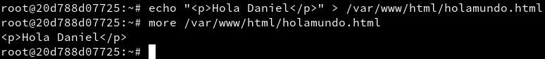


**Crear un script** `/root/server.sh` con el siguiente contenido:

```
#!/bin/bash
echo "Booting Nginx!"
/usr/sbin/nginx &

echo "Waiting..."
while(true) do
  sleep 60
done
```

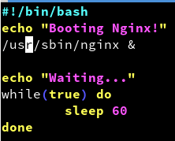

Recordatorio:
* Hay que poner permisos de ejecución al script para que se pueda ejecutar.
* La primera línea de un script, siempre debe comenzar por `#!/`, sin espacios.
* Este script inicia el programa/servicio y entra en un bucle, para permanecer activo y que no se cierre el contenedor.

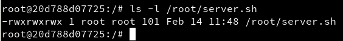


## 3.3 Crear una imagen a partir del contenedor

Ya tenemos nuestro contenedor auto-suficiente de Nginx, ahora debemos vamos a crear una nueva imagen que incluya los cambios que hemos hecho.

* Abrir otra ventana de terminal.
* `docker commit con_debian nombre-del-alumno/nginx1`, a partir del CONTAINERID vamos a crear la nueva imagen que se llamará "nombre-del-alumno/nginx1".

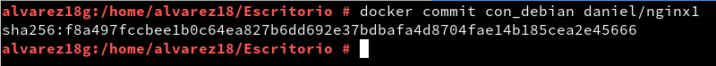

> NOTA:
>
> * Los estándares de Docker estipulan que los nombres de las imágenes deben seguir el formato `nombreusuario/nombreimagen`.
> * Todo cambio que se haga en la imagen, y no se le haga commit se perderá en cuanto se cierre el contenedor.

* `docker images`, comprobamos.

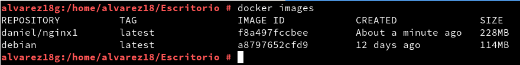

---
# 4. Crear contenedor a partir de nuestra imagen

## 4.1 Crear contenedor con Nginx

Ya tenemos una imagen "dvarrui/nginx" con Nginx instalado.
* `docker run --name=con_nginx -p 80 -t dvarrui/nginx1 /root/server.sh`, iniciar el contenedor a partir de la imagen anterior.

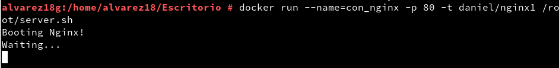

> El argumento `-p 80` le indica a Docker que debe mapear el puerto especificado del contenedor, en nuestro caso el puerto 80 es el puerto por defecto sobre el cual se levanta Nginx.

## 4.2 Comprobamos

* Abrimos una nueva terminal.
* `docker ps`, nos muestra los contenedores en ejecución. Podemos apreciar que la última columna nos indica que el puerto 80 del contenedor está redireccionado a un puerto local `0.0.0.0.:PORT -> 80/tcp`.

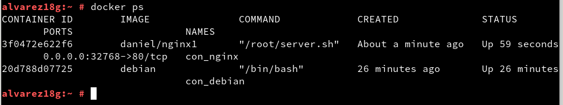

* Abrir navegador web y poner URL `0.0.0.0.:PORT`. De esta forma nos
conectaremos con el servidor Nginx que se está ejecutando dentro del contenedor.

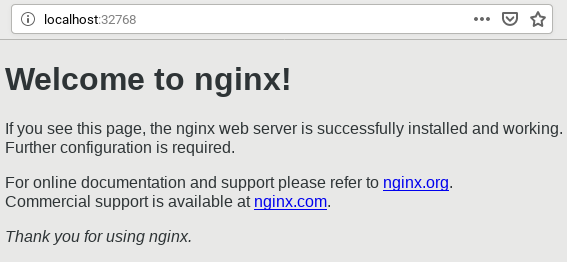


* Comprobar el acceso a `holamundo.html`.

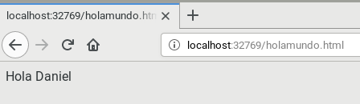

* Paramos el contenedor `con_nginx` y lo eliminamos.

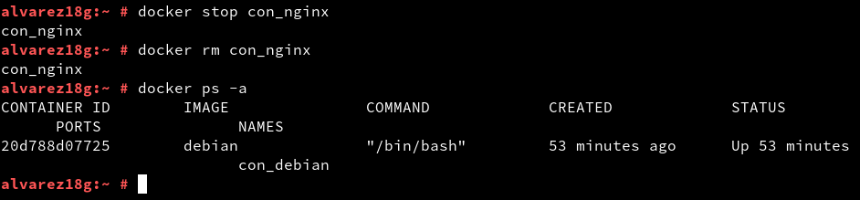

Como ya tenemos una imagen docker con Nginx, podremos crear nuevos contenedores
cuando lo necesitemos.

## 4.3 Migrar la imágen a otra máquina

¿Cómo puedo llevar los contenedores Docker a un nuevo servidor?

> Enlaces de interés
>
> * https://www.odooargentina.com/forum/ayuda-1/question/migrar-todo-a-otro-servidor-imagenes-docker-397
> * http://linoxide.com/linux-how-to/backup-restore-migrate-containers-docker/

**Exportar** imagen Docker a fichero tar:
* `docker save -o ~/alumnoXX.tar nombre-alumno/nginx1`, guardamos la imagen
"nombre-alumno/server" en un fichero tar.

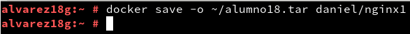

Intercambiar nuestra imagen exportada con la de un compañero de clase.

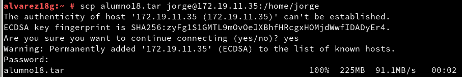

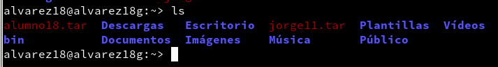

**Importar** imagen Docker desde fichero:
* Coger la imagen de un compañero de clase.
* Nos llevamos el tar a otra máquina con docker instalado, y restauramos.
* `docker load -i ~/alumnoXX.tar`, cargamos la imagen docker a partir del fichero tar.
* `docker images`, comprobamos que la nueva imagen está disponible.

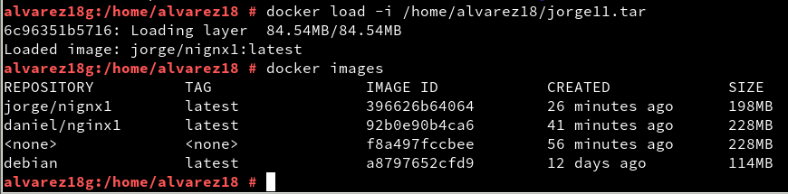

Ya podemos crear contenedores a partir de la nueva imagen.

---
# 5. Dockerfile

Ahora vamos a conseguir el mismo resultado del apartado anterior, pero
usando un fichero de configuración. Esto es, vamos a crear un contenedor a partir de un fichero `Dockerfile`.

## 5.1 Preparar ficheros

* Crear directorio `/home/nombre-alumno/dockerXXa`.
* Entrar el directorio anterior.


* Poner copia del fichero `holamundo.html` anterior.

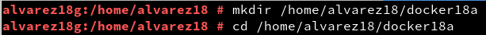

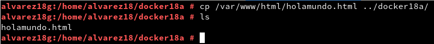

* Poner copia del fichero `server.sh` anterior.

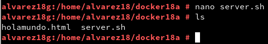

* Crear el fichero `Dockerfile` con el siguiente contenido:

```
FROM debian

MAINTAINER nombre-del-alumnoXX 1.0

RUN apt-get update
RUN apt-get install -y apt-utils
RUN apt-get install -y nginx

COPY holamundo.html /var/www/html
RUN chmod 666 /var/www/html/holamundo.html

COPY server.sh /root/server.sh
RUN chmod 755 /root/server.sh

EXPOSE 80

CMD ["/root/server.sh"]
```

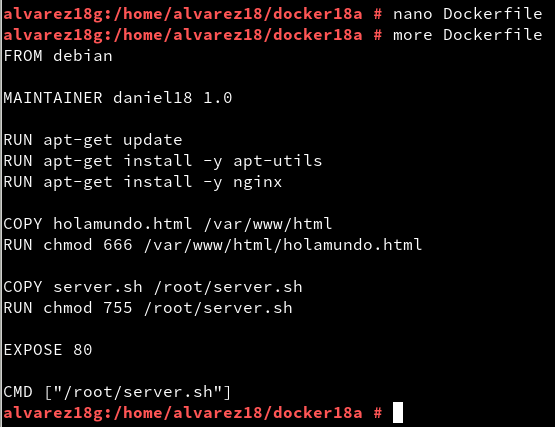

## 5.2 Crear imagen a partir del `Dockerfile`

El fichero Dockerfile contiene toda la información necesaria para construir el contenedor, veamos:

* `cd dockerXXa`, entramos al directorio con el Dockerfile.
* `docker build -t nombre-alumno/nginx2 .`, construye una nueva imagen a partir del Dockerfile. OJO: el punto final es necesario.

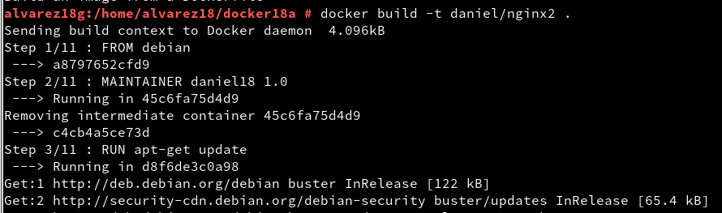

* `docker images`, ahora debe aparecer nuestra nueva imagen.

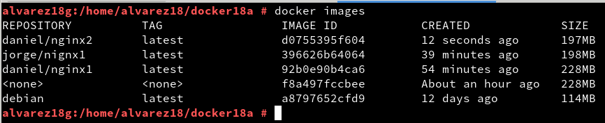

## 5.3 Crear contenedor y comprobar

A continuación vamos a crear un contenedor con el nombre `con_nginx2`, a partir de la imagen `dvarrui/nginx2`. Probaremos con:

* `docker run --name=con_nginx2 -t nombre-alumno/nginx2`

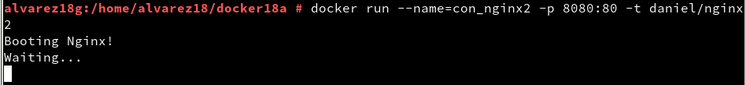

Desde otra terminal:
* `docker...`, para averiguar el puerto de escucha del servidor Nginx.

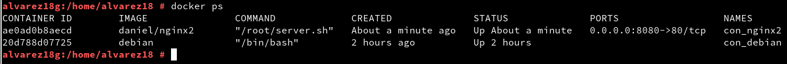

* Comprobar en el navegador:
    * URL `http://localhost:PORTNUMBER`

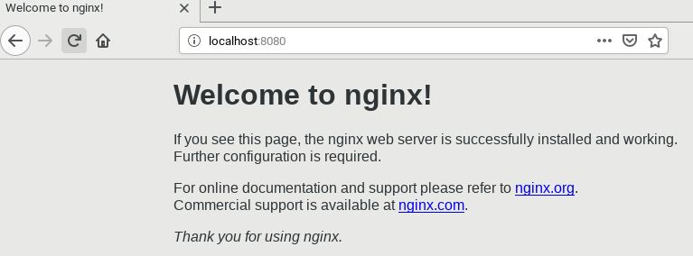

    * URL `http://localhost:PORTNUMBER/holamundo.html`

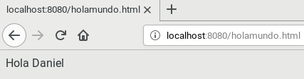

Ahora que sabemos usar los ficheros Dockerfile nos damos cuenta que es más sencillo usar estos ficheros para intercambiar imágenes docker con nuestros compañeros que las herramientas de exportar/importar que usamos anteriormente.

## 5.4 Usar imágenes ya creadas

El ejemplo anterior donde creábamos una imagen docker con nginx se puede simplificar aún más aprovechando imágenes que ya existen.

> Enlace de interés:
> * [nginx - Docker Official Images] https://hub.docker.com/_/nginx

* Crea el directorio `dockerXXb`. Entrar al directorio.
* Crea el siguiente `Dockerfile`

```
FROM nginx

COPY holamundo.html /var/www/html
RUN chmod 666 /var/www/html/holamundo.html
```

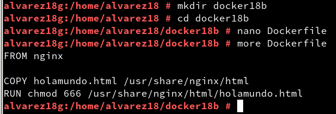

* `docker build -t nombre-alumno/nginx3`, crear la imagen.

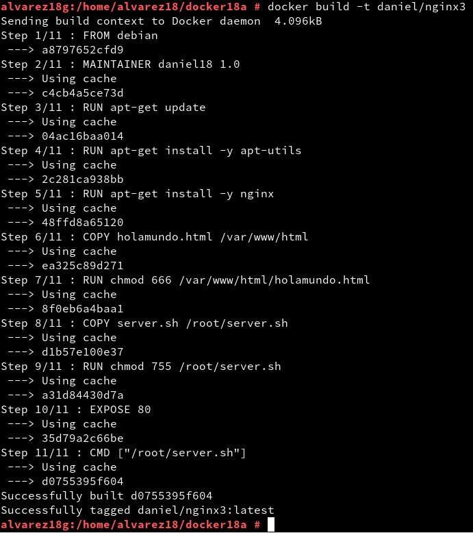

* `docker run --name con_nginx3 -d -p 8080:80 nombre-alumno/nginx3`, crear contenedor.

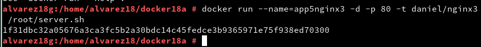

---
# 6. Limpiar contenedores e imágenes

Cuando terminamos con los contenedores, y ya no lo necesitamos, es buena idea pararlos y/o destruirlos.

* `docker ps -a`

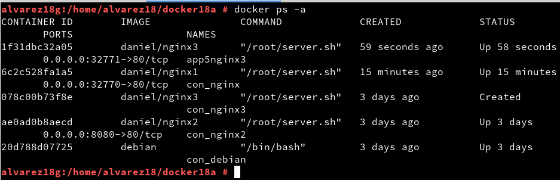

* `docker stop ...`

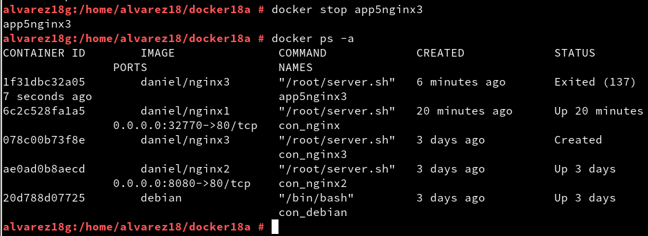

* `docker rm ...`

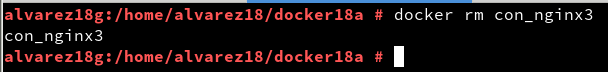

Lo mismo con las imágenes:

* `docker images`

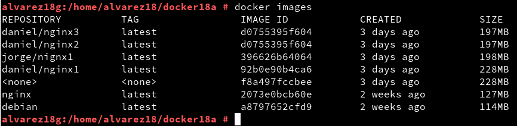

* `docker rmi ...`

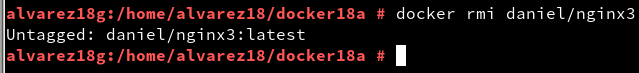
